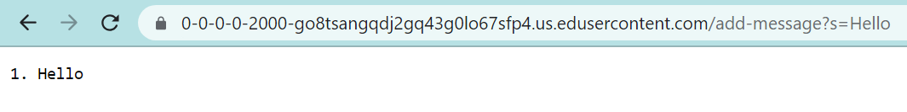
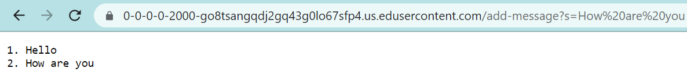
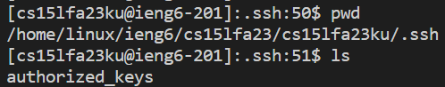
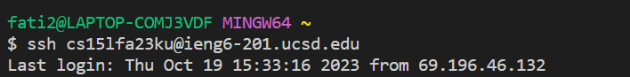

# Lab Report 2


Part 1
---
In this lab, we wrote a web server that's called **StringServer**. It stores a string that functions as a list, and this list is updated whenever an "add" request is made. 


Here's the code for StringServer.java:
```ruby
import java.io.IOException;
import java.net.URI;

class Handler implements URLHandler {
    // The one bit of state on the server: a list will be updated by
    // the add-message request.
    String list = "";
    int num= 0;

    public String handleRequest(URI url) {
        if (url.getPath().equals("/")) {
            return String.format("%s", list);
        } else {
            if (url.getPath().contains("/add-message")) {
                String[] parameters = url.getQuery().split("=");
                if (parameters[0].equals("s")) {
                    String[] words = parameters[1].split("\\+");
                    num +=1;
                    //list += Integer.toString(num)  + ". " + parameters[1] + "\n";


                    String wordsTog= "";
                    wordsTog = words[0];
                    for(int i= 1; i<words.length; i++){
                        wordsTog += " " + words[i];
                    }
                    //System.out.println(words.length);
                    list += Integer.toString(num)  + ". " + wordsTog + "\n";
                    //System.out.println(list);

                    return String.format("%s", list);
                }
            }
            return "404 Not Found!";
        }
    }
}

class StringServer {
    public static void main(String[] args) throws IOException {
        if(args.length == 0){
            System.out.println("Missing port number! Try any number between 1024 to 49151");
            return;
        }

        int port = Integer.parseInt(args[0]);
        
        Server.start(port, new Handler());
    }
}
```
To start the server, I first needed to compile it and Server.java and then run StringServer with a port number. And as seen in the StringServer class, the port number is used in the method `start` which initiates the server. After that we code open the URL and start making requests.  

For example: 
 
Here, to add "Hello," we need to use the method `handleRequest` whose argument is the whole URL and uses it to parse if there's the path **add-message** and adds whatever string is after the query. The `num` feild gets updated to 1 and shows up in next to the "Hello" string. The URL itself doesn't change with the exception of having a path. 

Continuing the example:  
   
We added the string "How are you" which uses the same method as "Hello," `handleRequest`. The `num` feild gets updated to 2 and shows up in next to the "How are you" string. The URL itself doesn't change with the exception of having a path that requests "How are you" instead of "Hello".  

Part 2
---
```ruby
fati2@LAPTOP-COMJ3VDF MINGW64 ~/.ssh
$ pwd
/c/Users/fati2/.ssh

fati2@LAPTOP-COMJ3VDF MINGW64 ~/.ssh
$ ls
id_rsa  id_rsa.pub  known_hosts
```

The path to the private key: `/c/Users/fati2/.ssh/id_rsa`  

  

The path to the public key: `/home/linux/ieng6/cs15lfa23/cs15lfa23ku/.ssh/authorized_keys`  

logging into ieng6 without being asked for a password:  
  

Part 3
---  

One of the new things I learned in this lab is that the plus sign is a meta charater that needs to be preceded with 2 backslashes:   `String[] words = parameters[1].split("\\+");`  
Another neat thing that I learned is not needing to type my password to login th `ieng6` account! I don't really understand the speficications of ssh keys but it's cool nonetheless. 
