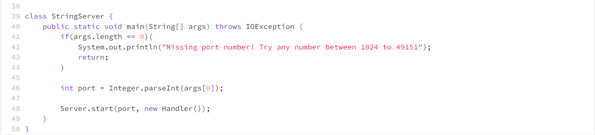

# Lab Report 2
In this lab, we wrote a web server that's called **StringServer**. It stores a string that functions as a list, and this list is updated whenever an "add" request is made.

 

out the string requests has the path *add-message*  

